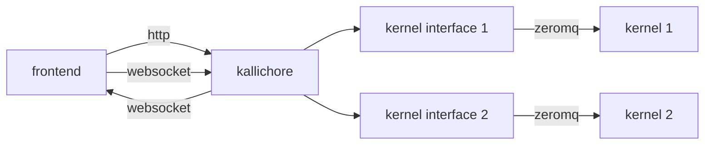

## Kallichore

Kallichore is an experimental, headless supervisor for Jupyter kernels.

It exposes a JSON API (described with OpenAPI) that can be used to start kernel sessions and query for their status. It also provides a WebSocket interface for sending and receiving Jupyter messages.

Multiple kernels/sessions can be supervised at once; each receives its own interface.



## Compiling and Running

### Compiling

To compile the Kallichore project, just run this in the root directory of the repository:

```bash
cargo build
```

### Running

Run the server from the `target` directory. You may want to set `RUST_LOG` to `trace` to get detailed debugging output.

```bash
export RUST_LOG=trace
./target/debug/kcserver
```

## API Changes

To make changes to the API, edit the `kallichore.json` file and then run the `scripts/regen-api.sh` script to regenerate the Rust client and server crates.

```bash
./scripts/regen-api.sh
```

> [!NOTE]
> The regenerator script requires the [OpenAPI Generator](https://openapi-generator.tech/docs/installation).

> [!IMPORTANT]
> Because we have custom behavior attached to some of the endpoints, we have some manual edits applied to the generated code. These are generally fenced with `--- Start Kallichore ---` and `--- End Kallichore ---` comments. Be sure to reapply these edits (or just revert changes that delete them) if you regenerate the API.

## Repository Structure

```
 .
 +-- kallichore.json -- OpenAPI description of the Kallichore API
 |
 +-- crates
      |
      +-- kallichore_api -- Code-generated Rust client/server
      |    |
      |    +-- examples/client -- Example client
      |    |
      |    +-- examples/server -- Example server
      |
      +-- kcshared -- Shared code for the server and client
      |
      +-- kcserver -- Main Kallichore server, using the kallichore_api crate
      |
      +-- kcclient -- Command-line client (for testing), using the kallichore_api crate
```

## Adjacent Projects/Links

[Jupyter Kernel Gateway](https://jupyter-kernel-gateway.readthedocs.io/en/latest/): a headless Jupyter server that uses WebSockets to deliver Jupyter messages.
