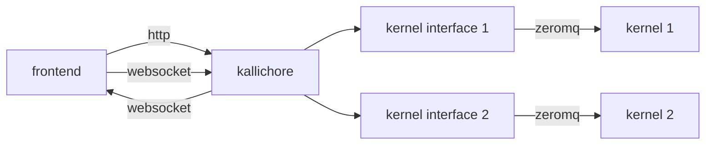
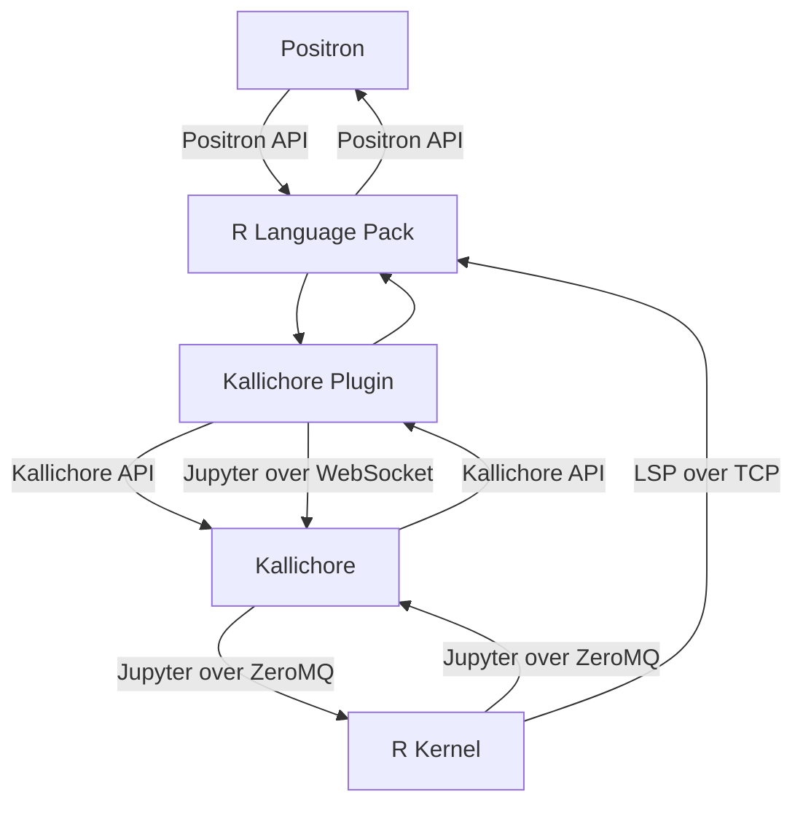

# Kallichore 

Kallichore is an experimental, cross-platform, headless supervisor for Jupyter kernels. It [exposes an API](https://github.com/posit-dev/kallichore/blob/main/kallichore.json) that can be used to manage kernel sessions and provides a WebSocket-compatible interface for sending and receiving Jupyter messages to each kernel.



Kallichore's primary residence is in [the Positron IDE](https://github.com/posit-dev/positron), where it provides durable Jupyter kernel sessions, especially in [Posit Workbench](https://posit.co/products/enterprise/workbench/). It takes care of the low-level minutiae of Jupyter kernel management (ZeroMQ, process interop, lifecycle supervision, etc.), leaving Positron to handle the user interface and other aspects of the development environment.

It is a companion to Posit's [Amalthea and Ark](https://github.com/posit-dev/ark) projects. Like Amalthea, it is a Rust-based, Jupyter-adjacent project named after [one of Jupiter's moons](https://science.nasa.gov/jupiter/moons/kallichore/). Kallichore is also [one of the Muses](https://en.wikipedia.org/wiki/Callichore).

Here's how Kallichore functions in the larger Positron ecosystem for e.g. an R session:



## Running Kallichore

To run Kallichore, first get a copy of the server from the GitHub Releases page on this repository (or build your own; see below for instructions). This release contains a pre-built binary named `kcserver` for your platform.

For most use cases, it's recommended to run `kcserver` with the `--connection-file` argument to have Kallichore generate a connection file for your client. On a typical Unix-like system, you might use a temporary file for connection information and tell Kallichore to use domain sockets as the transport (TCP and named pipes are also supported; see [Connection Methods](#connection-methods) for details):

```bash
./kcserver --transport socket --connection-file /tmp/kc-connection-file.json
```

The server will start up and listen for incoming connections on the specified transport and generate a bearer auth token (see below for [Security Considerations](#security-considerations)). Your client can read connection details from the connection file and connect to the server using the appropriate transport. The connection file looks like this:

```json
{
  "socket_path": "/tmp/path-to/socket/kc-5259.sock",
  "transport": "socket",
  "server_path": "/path/to/kcserver",
  "server_pid": 5259,
  "bearer_token": "4dea37b8a3b3e09f",
  "log_path": null
}
```

See Kallichore's help page for a full list of command-line options:

```bash
./kcserver --help
```

### Starting and Connecting to Kernels

Once the server is alive, you're ready to run kernels. Typically, you'll use the following API methods:

- Create a new session by executing a `PUT` on `/sessions` with the session information. The new session ID is returned (let's say it's `session1234`)
- Begin listening to kernel events and output from the session by getting a WebSocket URL or path from the `/sessions/session1234/channels` method and connecting to it in your client.
- Ask the session to start by executing a `POST` on `/sessions/session1234/start`. During startup, state changes and output will be sent to the WebSocket connection.
- Once the session is successfully started, use your WebSocket connection to send and receive messages to/from the kernel.

### Kernel and Server Lifecycles

By default, the server will run indefinitely until it is manually stopped. You can stop it by sending a `SIGINT` signal to the process, or by invoking the `/shutdown` API. Either one will attempt to gracefully shut down all active kernels (sending each a Jupyter message requesting shutdown) and then exit the server itself.

You can also cause Kallichore to exit after a period of inactivity by setting the `--idle-shutdown-hours` parameter when starting the server. This option will keep the server running as long as any kernel is active; the shutdown timer starts running only when all kernels are idle and none are connected to a front end.

## Security Considerations

> [!IMPORTANT]
> Kallichore's API accepts arbitrary paths to executable files, and will run them as subprocesses. Jupyter kernels can also be made to execute arbitrary commands, which can be used to execute malicious code. This presents a significant security risk if security measures are not in place to prevent unauthorized execution.

The following steps are recommended to ensure the security of your Kallichore instance:

1. **Use a low-privilege user account**: Run Kallichore under a non-privileged user account, not as root. Because Jupyter kernels are basically code execution environments, presume that giving a user access to Kallichore's API is equivalent to giving them shell access.
2. **Use IPC, not TCP**: If running Kallichore locally, use domain sockets (Unix/macOS) or named pipes (Windows) as the transport. These transports are more secure than TCP, as they can be locked down with file system permissions and do not expose the server to the network.
3. **Secure the authentication token**: Kallichore uses a simple bearer token for authentication. If generating the token yourself, pass it as a file (so that it is not exposed in the process list) and delete it once the server has started. If allowing the server to generate the token, delete the connection file once it has been read.

## Development

### Compiling

To compile the Kallichore project, just run this in the root directory of the repository:

```bash
cargo build
```

### Running

Run the server from the `target` directory. You may want to set `RUST_LOG` to `trace` to get detailed debugging output.

```bash
export RUST_LOG=trace
./target/debug/kcserver
```

## Repository Structure

```
 .
 +-- kallichore.json -- OpenAPI description of the Kallichore API
 |
 +-- crates
      |
      +-- kallichore_api -- Code-generated Rust client/server
      |    |
      |    +-- examples/client -- Example client
      |    |
      |    +-- examples/server -- Example server
      |
      +-- kcshared -- Shared code for the server and client
      |
      +-- kcserver -- Main Kallichore server, using the kallichore_api crate
      |
      +-- kcclient -- Command-line client (for testing), using the kallichore_api crate
```

## API Changes

To make changes to the API, edit the `kallichore.json` file and then run the `scripts/regen-api.sh` script to regenerate the Rust client and server crates.

```bash
./scripts/regen-api.sh
```

> [!NOTE]
> The regenerator script requires the [OpenAPI Generator](https://openapi-generator.tech/docs/installation).

> [!IMPORTANT]
> The code generator produces code with HTTPS support. We remove the TLS/HTTPS support from the generated code in order to avoid creating a binary that links to OpenSSL (which would introduce a lot of system compatibility issues).

## Connection Methods

Kallichore supports multiple transport mechanisms for client connections. The server can be configured to use TCP, Unix domain sockets, or Windows named pipes.

### TCP (Default)

TCP is the default transport method that works across all platforms. In TCP mode, the supervisor listens on a local TCP port and accepts RPCs over HTTP. This is suitable for remote connections and works on all operating systems.

Connections to individual kernels are made with WebSockets, which are established over the HTTP connection.

#### Starting the server with TCP

```bash
# Use default port (random)
./kcserver

# Use specific port
./kcserver --port 8080

# Create a connection file with TCP
./kcserver --connection-file connection.json --transport tcp
```

#### Example TCP connection file

When using `--connection-file`, the server writes connection details to the specified file:

```json
{
  "port": 54321,
  "base_path": "http://127.0.0.1:54321",
  "transport": "tcp",
  "server_path": "/path/to/kcserver",
  "server_pid": 12345,
  "bearer_token": "your-auth-token",
  "log_path": "/path/to/logfile.log"
}
```

### Unix Domain Sockets (Unix/Linux/macOS)

Unix domain sockets provide high-performance IPC for local connections on Unix-like systems. They offer better security than TCP, since they use filesystem permissions. However, they are not available on Windows and are not suitable for remote connections.

When using domain sockets, the server listens on a specific socket file instead of a TCP port. When connecting to individual kernels, each kernel gets a dedicated Unix socket for communication.

#### Starting the server with Unix sockets

```bash
# Use connection file with socket (default on Unix when using --connection-file)
./kcserver --connection-file connection.json

# Explicitly specify socket transport
./kcserver --connection-file connection.json --transport socket

# Use specific socket path
./kcserver --unix-socket /tmp/kallichore.sock
```

#### Example Unix socket connection file

```json
{
  "socket_path": "/tmp/kallichore-12345.sock",
  "transport": "socket",
  "server_path": "/path/to/kcserver",
  "server_pid": 12345,
  "bearer_token": "your-auth-token",
  "log_path": "/path/to/logfile.log"
}
```

### Named Pipes (Windows)

Named pipes are the Windows equivalent of Unix domain sockets, providing efficient local IPC on Windows systems. They are not available on Unix-like systems and are only used for local connections.

When using named pipes, the server listens on a named pipe path instead of a TCP port or Unix socket. Each kernel session also gets its own named pipe for communication.

#### Starting the server with named pipes

```bash
# Use connection file with named pipe (default on Windows when using --connection-file)
kcserver.exe --connection-file connection.json

# Explicitly specify named pipe transport
kcserver.exe --connection-file connection.json --transport named-pipe
```

#### Example named pipe connection file

```json
{
  "named_pipe": "\\\\.\\pipe\\kallichore-12345",
  "transport": "named-pipe",
  "server_path": "C:\\path\\to\\kcserver.exe",
  "server_pid": 12345,
  "bearer_token": "your-auth-token",
  "log_path": "C:\\path\\to\\logfile.log"
}
```

### Transport Selection Rules

The server automatically selects the appropriate transport based on:

1. **Explicit `--transport` flag**: Overrides all other settings
2. **Connection file mode**: Defaults to `socket` on Unix, `named-pipe` on Windows, `tcp` elsewhere
3. **Direct mode**: Uses `tcp` when no connection file is specified

### Security Considerations

- **TCP**: Binds to `127.0.0.1` (localhost only) by default for security
- **Unix Sockets**: Use filesystem permissions for access control
- **Named Pipes**: Use Windows security descriptors for access control
- **Authentication**: All transports support bearer token authentication when enabled


## Builds and Versions

Kallichore is versioned similar to ARK. No release builds are produced by default. When you want to release a new version of Kallichore (for integrating into Positron, etc.), bump the version of the `kcserver` crate. This will trigger a release build.

## Adjacent Projects/Links

[Jupyter Kernel Gateway](https://jupyter-kernel-gateway.readthedocs.io/en/latest/): a headless Jupyter server that uses WebSockets to deliver Jupyter messages.
