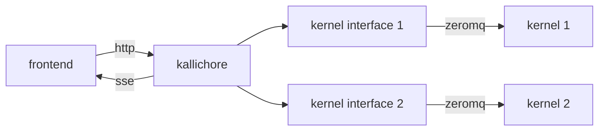

## Kallichore

Kallichore is an experimental, headless supervisor for Jupyter kernels.

It exposes a JSON API (described with OpenAPI) that can be used to start a kernel, send messages to and receive messages from the kernel, and stop the kernel.

Multiple kernels/sessions can be supervised at once; each receives its own interface.



## Compiling and Running

### Compiling

To compile the Kallichore project, just run this in the root directory of the repository:

```bash
cargo build
```

### Running

Run the server from the `target` directory. You may want to set `RUST_LOG` to `trace` to get detailed debugging output.

```bash
export RUST_LOG=trace
./target/debug/kcserver
```

## API Changes

To make changes to the API, edit the `kallichore.json` file and then run the `scripts/regen-api.sh` script to regenerate the Rust client and server crates.

```bash
./scripts/regen-api.sh
```

> [!NOTE]
> The regenerator script requires the [OpenAPI Generator](https://openapi-generator.tech/docs/installation).
