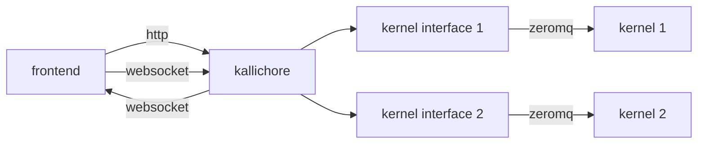

# Kallichore 

Kallichore is an experimental, headless supervisor for Jupyter kernels.

It exposes a JSON API (described with OpenAPI) that can be used to start kernel sessions and query for their status. It also provides a WebSocket interface for sending and receiving Jupyter messages.

Multiple kernels/sessions can be supervised at once; each receives its own interface.



## Compiling and Running

### Compiling

To compile the Kallichore project, just run this in the root directory of the repository:

```bash
cargo build
```

### Running

Run the server from the `target` directory. You may want to set `RUST_LOG` to `trace` to get detailed debugging output.

```bash
export RUST_LOG=trace
./target/debug/kcserver
```

## API Changes

To make changes to the API, edit the `kallichore.json` file and then run the `scripts/regen-api.sh` script to regenerate the Rust client and server crates.

```bash
./scripts/regen-api.sh
```

> [!NOTE]
> The regenerator script requires the [OpenAPI Generator](https://openapi-generator.tech/docs/installation).

> [!IMPORTANT]
> Because we have custom behavior attached to some of the endpoints, we have some manual edits applied to the generated code. These are generally fenced with `--- Start Kallichore ---` and `--- End Kallichore ---` comments. Be sure to reapply these edits (or just revert changes that delete them) if you regenerate the API.

## Connection Methods

Kallichore supports multiple transport mechanisms for client connections, allowing flexibility based on platform capabilities and security requirements. The server can be configured to use TCP, Unix domain sockets, or Windows named pipes.

### TCP (Default)

TCP is the default transport method that works across all platforms.

#### Starting the server with TCP

```bash
# Use default port (random)
./target/debug/kcserver

# Use specific port
./target/debug/kcserver --port 8080

# Create a connection file with TCP
./target/debug/kcserver --connection-file connection.json --transport tcp
```

#### Example TCP connection file

When using `--connection-file`, the server writes connection details to the specified file:

```json
{
  "port": 54321,
  "base_path": "http://127.0.0.1:54321",
  "socket_path": null,
  "named_pipe": null,
  "transport": "tcp",
  "server_path": "/path/to/kcserver",
  "server_pid": 12345,
  "bearer_token": "your-auth-token",
  "log_path": "/path/to/logfile.log"
}
```

### Unix Domain Sockets (Unix/Linux/macOS)

Unix domain sockets provide high-performance IPC for local connections on Unix-like systems. They offer better security than TCP as they use filesystem permissions.

#### Starting the server with Unix sockets

```bash
# Use connection file with socket (default on Unix when using --connection-file)
./target/debug/kcserver --connection-file connection.json

# Explicitly specify socket transport
./target/debug/kcserver --connection-file connection.json --transport socket

# Use specific socket path
./target/debug/kcserver --unix-socket /tmp/kallichore.sock
```

#### Example Unix socket connection file

```json
{
  "port": null,
  "base_path": null,
  "socket_path": "/tmp/kallichore-12345.sock",
  "named_pipe": null,
  "transport": "socket",
  "server_path": "/path/to/kcserver",
  "server_pid": 12345,
  "bearer_token": "your-auth-token",
  "log_path": "/path/to/logfile.log"
}
```

### Named Pipes (Windows)

Named pipes are the Windows equivalent of Unix domain sockets, providing efficient local IPC on Windows systems.

#### Starting the server with named pipes

```bash
# Use connection file with named pipe (default on Windows when using --connection-file)
kcserver.exe --connection-file connection.json

# Explicitly specify named pipe transport
kcserver.exe --connection-file connection.json --transport named-pipe
```

#### Example named pipe connection file

```json
{
  "port": null,
  "base_path": null,
  "socket_path": null,
  "named_pipe": "\\\\.\\pipe\\kallichore-12345",
  "transport": "named-pipe",
  "server_path": "C:\\path\\to\\kcserver.exe",
  "server_pid": 12345,
  "bearer_token": "your-auth-token",
  "log_path": "C:\\path\\to\\logfile.log"
}
```

### Transport Selection Rules

The server automatically selects the appropriate transport based on:

1. **Explicit `--transport` flag**: Overrides all other settings
2. **Connection file mode**: Defaults to `socket` on Unix, `named-pipe` on Windows, `tcp` elsewhere
3. **Direct mode**: Uses `tcp` when no connection file is specified

### Security Considerations

- **TCP**: Binds to `127.0.0.1` (localhost only) by default for security
- **Unix Sockets**: Use filesystem permissions for access control
- **Named Pipes**: Use Windows security descriptors for access control
- **Authentication**: All transports support bearer token authentication when enabled

## Repository Structure

```
 .
 +-- kallichore.json -- OpenAPI description of the Kallichore API
 |
 +-- crates
      |
      +-- kallichore_api -- Code-generated Rust client/server
      |    |
      |    +-- examples/client -- Example client
      |    |
      |    +-- examples/server -- Example server
      |
      +-- kcshared -- Shared code for the server and client
      |
      +-- kcserver -- Main Kallichore server, using the kallichore_api crate
      |
      +-- kcclient -- Command-line client (for testing), using the kallichore_api crate
```


## Builds and Versions

Kallichore is versioned similar to ARK. No release builds are produced by default. When you want to release a new version of Kallichore (for integrating into Positron, etc.), bump the version of the `kcserver` crate. This will trigger a release build.

Note that because this repository is private, and Positron is public, there's a public repository that hosts Kallichore builds for Positron to download while building. You can find that here:

<https://github.com/posit-dev/kallichore-builds>

All Kallichore releases are automatically copied to the `kallichore-builds` repository.

## Adjacent Projects/Links

[Jupyter Kernel Gateway](https://jupyter-kernel-gateway.readthedocs.io/en/latest/): a headless Jupyter server that uses WebSockets to deliver Jupyter messages.
