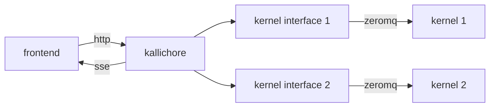

## Kallichore

Kallichore is an experimental, headless supervisor for Jupyter kernels. 

It exposes a JSON API that can be used to start a kernel, send messages to and receive messages from the kernel, and stop the kernel. 

Multiple kernels/sessions can be supervised at once; each receives its own interface. 

